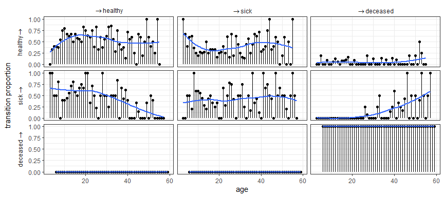
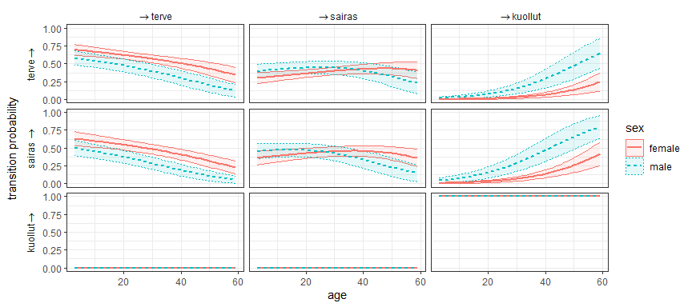

<!-- README.md is generated from README.Rmd. Please edit that file -->

# nhmgrid: An R package for visualization of nonhomogeneous Markov model probabilities

<!-- badges: start -->

[](https://www.repostatus.org/#inactive)
<!-- badges: end -->

The `nhmgrid` R package provides an easy-to-use interface for estimation
and visualization of non-homogeneous Markov model transition
probabilities. The main features in the package are:

- Supports a variety of model types in transition probability estimation
  using marginaleffects.
- Is able to calculate state transition proportions without a model.
- Produces highly customizable plots using ggplot2.

## Installation

You can install the most recent version of `nhmgrid` by running the
following lines:

``` r
# install.packages("devtools")
devtools::install_github("joakim219/nhmgrid")
```

## Example

The package contains a simulated panel data set `health`. The data set
consists of 50 individuals whose health state has been measured every
year for 10 years.

``` r
library(nhmgrid)

head(health, 12)
#>    id    sex age    state lagstate
#> 1   1   male  32     sick     <NA>
#> 2   1   male  33     sick     sick
#> 3   1   male  34  healthy     sick
#> 4   1   male  35  healthy  healthy
#> 5   1   male  36     sick  healthy
#> 6   1   male  37  healthy     sick
#> 7   1   male  38  healthy  healthy
#> 8   1   male  39  healthy  healthy
#> 9   1   male  40 deceased  healthy
#> 10  1   male  41 deceased deceased
#> 11  2 female   6  healthy     <NA>
#> 12  2 female   7  healthy  healthy
nrow(health)
#> [1] 500
```

One can calculate the transition proportions between the health states
using `stprops` and plotthem. Because the plot is constructed using
ggplot2, it is highly customizable.

``` r
props <- stprops(health, x = "age", state = "state", id = "id")
plot(props) +
  ggplot2::geom_smooth(se = FALSE)
```



The transition probabilities between the states can be estimated with a
Markov model using `stprobs`. In this example we fit a multinomial
logistic regression model and group the probabilities separately for men
and women.

``` r
fit <- nnet::multinom(state ~ lagstate + age + sex, data = health)
probs <- stprobs(fit, x = "age", group = "sex")
plot(probs)
```



For more examples, see the package documentation.
